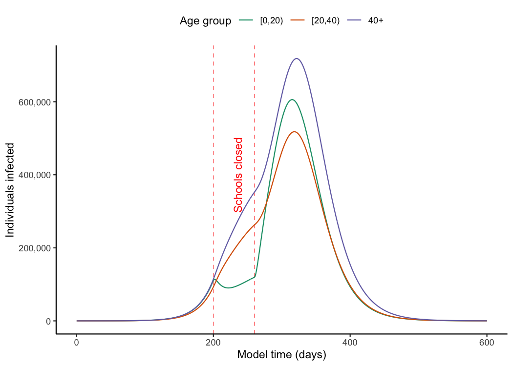

# *epidemics*: A library of compartmental epidemic scenario models

<!--  -->

*epidemics* is an R package that provides an easy interface to a library
of compartmental models that can help to model epidemic scenarios for
directly transmitted infections such as influenza, Covid-19, or
respiratory syncytial virus (RSV).

*epidemics* currently provides a single model with susceptible, exposed,
infectious, recovered, and vaccinated compartments (SEIR-V), allowing
for heterogeneity in social contacts, the implementation of a
group-specific non-pharmaceutical intervention that reduces social
contacts, and a vaccination regime with group-specific start and end
dates.

*epidemics* implements methods outlined in Bjørnstad et al.
([2020a](#ref-bjornstad2020a)) and Bjørnstad et al.
([2020b](#ref-bjornstad2020)).

The models in *epidemics* can help provide rough estimates of the course
of epidemics, and the effectiveness of pharmaceutical and
non-pharmaceutical interventions

*epidemics* relies on [Eigen](https://gitlab.com/libeigen/eigen) via
[{RcppEigen}](https://cran.r-project.org/web/packages/RcppEigen/index.html),
and on [Boost
Odeint](https://www.boost.org/doc/libs/1_82_0/libs/numeric/odeint/doc/html/index.html)
via [{BH}](https://cran.r-project.org/web/packages/BH/index.html), and
is developed at the [Centre for the Mathematical Modelling of Infectious
Diseases](https://www.lshtm.ac.uk/research/centres/centre-mathematical-modelling-infectious-diseases)
at the London School of Hygiene and Tropical Medicine as part of the
[Epiverse-TRACE initiative](https://data.org/initiatives/epiverse/).

<!-- badges: start -->

[](https://opensource.org/licenses/MIT)
[](https://github.com/epiverse-trace/epidemics/actions/workflows/R-CMD-check.yaml)
[](https://app.codecov.io/gh/epiverse-trace/epidemics?branch=main)
[](https://www.repostatus.org/#wip)
[](https://CRAN.R-project.org/package=epidemics)
<!-- badges: end -->

## Installation

The current development version of *epidemics* can be installed from
[GitHub](https://github.com/) using the `pak` package.

``` r
if(!require("pak")) install.packages("pak")
pak::pak("epiverse-trace/epidemics")
```

## Quick start

Here we show an example of using *epidemics* to model an epidemic in the
U.K. population with an $R_0$ similar to that of pandemic influenza,
with heterogeneity in social contacts among different age groups, and
with the implementation of school closures to dampen the spread of the
infection.

``` r
# load epidemics
library(epidemics)
library(ggplot2)
library(data.table)
```

Prepare the social contact pattern for a population (here, the U.K
population), divided into three age groups: 0 – 19, 20 – 39, and 40+.

``` r
# load contact and population data from socialmixr::polymod
polymod <- socialmixr::polymod
contact_data <- socialmixr::contact_matrix(
  polymod,
  countries = "United Kingdom",
  age.limits = c(0, 20, 40),
  symmetric = TRUE
)

# prepare contact matrix
contact_matrix <- t(contact_data$matrix)

# prepare the demography vector
demography_vector <- contact_data$demography$population
names(demography_vector) <- rownames(contact_matrix)
```

Prepare the initial conditions for the population by age group — here,
one in every million individuals is infected at the start of the
epidemic (for a total of about 60 infections).

``` r
# initial conditions: one in every 1 million is infected
initial_i <- 1e-6
initial_conditions <- c(
  S = 1 - initial_i, E = 0, I = initial_i, R = 0, V = 0
)

# build for all age groups
initial_conditions <- rbind(
  initial_conditions,
  initial_conditions,
  initial_conditions
)
rownames(initial_conditions) <- rownames(contact_matrix)
```

Prepare an object of the class `<population>`, using the function
`population()`.

``` r
# prepare the population to model as affected by the epidemic
uk_population <- population(
  name = "UK",
  contact_matrix = contact_matrix,
  demography_vector = demography_vector,
  initial_conditions = initial_conditions
)
```

Prepare an `<infection>` class object to store the parameters of the
infection which is causing the epidemic which is being modelled.

``` r
# simulate a pandemic, with an R0,
# an infectious period, and an pre-infectious period
pandemic_influenza <- infection(
  r0 = 1.5,
  preinfectious_period = 3,
  infectious_period = 7
)

pandemic_influenza
#> <infection>
#> infection name: NA
#> R0: 1.5
#> Infectious period: 7
#> Other infection parameters:
#> "preinfectious_period"
```

Define an intervention to close schools for two months. This
intervention mostly only affects individuals in the age range 0 – 19,
and reduces their contacts by 50%, reducing the contacts of other age
groups by 1%. This is an object of the class `<intervention>`, created
using the function `intervention()`.

``` r
# an intervention to close schools
close_schools <- intervention(
  time_begin = 200,
  time_end = 260,
  contact_reduction = c(0.5, 0.01, 0.01)
)
```

Prepare an infection

Run the default epidemic model, using the function `epidemic()`. We
assume an $R_0$ of 1.5 which is similar to pandemic influenza, an
infectious period of 7 days, and a pre-infectious period of 3 days.

``` r
# run an epidemic model using `epidemic()`
output <- epidemic(
  model = "default",
  population = uk_population,
  infection = pandemic_influenza,
  intervention = close_schools,
  time_end = 600, increment = 1.0
)
```

Visualise the development of individuals in the “infectious” compartment
over model time. Note that these curves represent the number of
individuals that are infectious, and not the number of newly infectious
individuals.



## Package vignettes

More details on how to use *epidemics* can be found in the [online
documentation as package
vignettes](https://epiverse-trace.github.io/epidemics/), under
“Articles”.

## Help

To report a bug please open an
[issue](https://github.com/epiverse-trace/epidemics/issues/new/choose).

## Contribute

Contributions to *epidemics* are welcomed. Please follow the [package
contributing
guide](https://github.com/epiverse-trace/epidemics/blob/main/.github/CONTRIBUTING.md).

## Code of conduct

Please note that the *epidemics* project is released with a [Contributor
Code of
Conduct](https://github.com/epiverse-trace/.github/blob/main/CODE_OF_CONDUCT.md).
By contributing to this project, you agree to abide by its terms.

## References

<div id="refs" class="references csl-bib-body hanging-indent">

<div id="ref-bjornstad2020a" class="csl-entry">

Bjørnstad, Ottar N., Katriona Shea, Martin Krzywinski, and Naomi Altman.
2020a. “Modeling Infectious Epidemics.” *Nature Methods* 17 (5): 455–56.
<https://doi.org/10.1038/s41592-020-0822-z>.

</div>

<div id="ref-bjornstad2020" class="csl-entry">

———. 2020b. “The SEIRS Model for Infectious Disease Dynamics.” *Nature
Methods* 17 (6): 557–58. <https://doi.org/10.1038/s41592-020-0856-2>.

</div>

</div>
