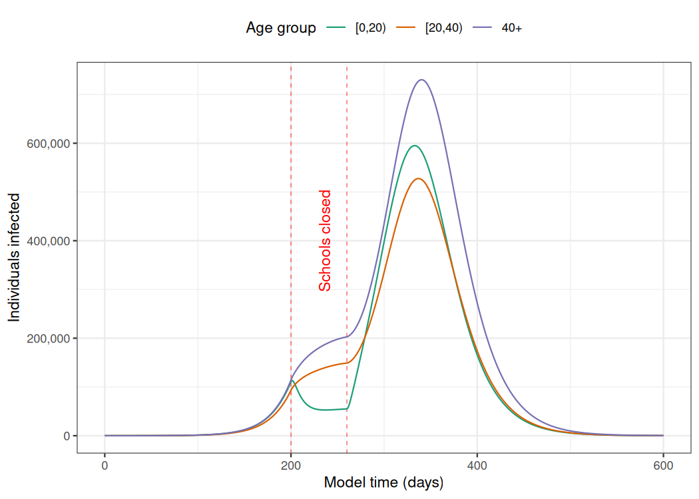

# epidemics: A library of compartmental epidemic scenario models 

<!-- badges: start -->

[](https://opensource.org/license/mit/)
[](https://github.com/epiverse-trace/epidemics/actions/workflows/R-CMD-check.yaml)
[](https://app.codecov.io/gh/epiverse-trace/epidemics?branch=main)
[](https://www.repostatus.org/#wip)
[](https://CRAN.R-project.org/package=epidemics)
<!-- badges: end -->

*epidemics* is an R package that provides a convenient interface to a
library of compartmental models that can help to model epidemic
scenarios for directly transmitted respiratory infections such as
influenza or Covid-19 as well haemorrhagic fevers such as Ebola virus
disease.

The models in *epidemics* implement methods outlined in Bjørnstad et al.
([2020a](#ref-bjornstad2020a)) and Bjørnstad et al.
([2020b](#ref-bjornstad2020)). The models in *epidemics* can help
provide rough estimates of the course of epidemics, and the
effectiveness of pharmaceutical and non-pharmaceutical interventions.

*epidemics* relies on [Eigen](https://gitlab.com/libeigen/eigen) via
[{RcppEigen}](https://cran.r-project.org/package=RcppEigen), and on
[Boost
Odeint](https://www.boost.org/doc/libs/1_82_0/libs/numeric/odeint/doc/html/index.html)
via [{BH}](https://cran.r-project.org/package=BH), and is developed at
the [Centre for the Mathematical Modelling of Infectious
Diseases](https://www.lshtm.ac.uk/research/centres/centre-mathematical-modelling-infectious-diseases)
at the London School of Hygiene and Tropical Medicine as part of the
[Epiverse-TRACE initiative](https://data.org/initiatives/epiverse/).

## Installation

The current development version of *epidemics* can be installed from
[GitHub](https://github.com/) using the *pak* package.

``` r
if(!require("pak")) install.packages("pak")
pak::pak("epiverse-trace/epidemics")
```

### Installation Notes

1.  Some users who are also using or developing packages that use Stan
    might face issues if they have modified their toolchain to
    accommodate packages such as
    [*cmdstanr*](https://mc-stan.org/cmdstanr/); see [this resolved
    issue](https://github.com/stan-dev/cmdstanr/issues/790) for a
    starting point if you face similar problems.

2.  Users on Windows systems will need to have packages from the
    *RTools* family installed and on their system path; see [this link
    for guidance on using
    *RTools*](https://cran.r-project.org/bin/windows/Rtools/) for your
    version of R.

## Quick start

Here we show an example of using the default model in *epidemics* to
model an epidemic in the U.K. population with an $R_0$ similar to that
of pandemic influenza, with heterogeneity in social contacts among
different age groups, and with the implementation of school closures to
dampen the spread of the infection.

``` r
# load epidemics
library(epidemics)
library(ggplot2)
library(dplyr)
```

Prepare the social contact pattern for a population (here, the U.K
population), divided into three age groups: 0 – 19, 20 – 39, and 40+.

``` r
# load contact and population data from socialmixr::polymod
polymod <- socialmixr::polymod
contact_data <- socialmixr::contact_matrix(
  polymod,
  countries = "United Kingdom",
  age.limits = c(0, 20, 40),
  symmetric = TRUE
)

# prepare contact matrix
contact_matrix <- t(contact_data[["matrix"]])

# prepare the demography vector
demography_vector <- contact_data[["demography"]][["population"]]
names(demography_vector) <- rownames(contact_matrix)
```

Prepare the initial conditions for the population by age group — here,
one in every million individuals is infected at the start of the
epidemic (for a total of about 60 infections).

``` r
# initial conditions: one in every 1 million is infected
initial_i <- 1e-6
initial_conditions <- c(
  S = 1 - initial_i, E = 0, I = initial_i, R = 0, V = 0
)

# build for all age groups
initial_conditions <- rbind(
  initial_conditions,
  initial_conditions,
  initial_conditions
)
rownames(initial_conditions) <- rownames(contact_matrix)
```

Prepare an object of the class `<population>`, using the function
`population()`.

``` r
# prepare the population to model as affected by the epidemic
uk_population <- population(
  name = "UK",
  contact_matrix = contact_matrix,
  demography_vector = demography_vector,
  initial_conditions = initial_conditions
)
```

Define an intervention to close schools for two months. This
intervention mostly only affects individuals in the age range 0 – 19,
and reduces their contacts by 50%, reducing the contacts of other age
groups by 1%. This is an object of the class `<contacts_intervention>`,
created using the function `intervention()`, while setting
`type = "contacts"`.

``` r
# an intervention to close schools
close_schools <- intervention(
  type = "contacts",
  time_begin = 200,
  time_end = 260,
  reduction = matrix(c(0.5, 0.01, 0.01))
)

# view the intervention
close_schools
#> 
#>  Intervention name: 
#>  Begins at: 
#> [1] 200
#> 
#>  Ends at: 
#> [1] 260
#> 
#>  Reduction: 
#>              Interv. 1
#> Demo. grp. 1      0.50
#> Demo. grp. 2      0.01
#> Demo. grp. 3      0.01
```

Run the default epidemic model, using the function `model_default()`. We
assume an $R_0$ of 1.5 which is similar to pandemic influenza, an
infectious period of 7 days, and a pre-infectious period of 3 days. From
these values we can calculate transmissibility $\beta$ `1.5 / 7.0`,
infectiousness_rate $\alpha$ `1.0 / 3.0` and recovery_rate $\gamma$
`1.0 / 7.0`.

``` r
# run an epidemic model using `epidemic()`
output <- model_default(
  population = uk_population,
  transmissibility = 1.5 / 7.0,
  infectiousness_rate = 1.0 / 3.0,
  recovery_rate = 1.0 / 7.0,
  intervention = list(contacts = close_schools),
  time_end = 600, increment = 1.0
)
```

Visualise the development of individuals in the “infectious” compartment
over model time. Note that these curves represent the number of
individuals that are infectious, and not the number of newly infectious
individuals.



## Package vignettes

More details on how to use *epidemics* can be found in the [online
documentation as package
vignettes](https://epiverse-trace.github.io/epidemics/), under
“Articles”.

## Package models

*epidemics* currently provides three models:

1.  A deterministic SEIR-V model with susceptible, exposed, infectious,
    recovered, and vaccinated compartments (SEIR-V), allowing for
    heterogeneity in social contacts, the implementation of a
    group-specific non-pharmaceutical intervention that reduces social
    contacts, and a vaccination regime with group-specific start and end
    dates,

2.  The deterministic Vacamole model developed at [RIVM, the Dutch
    Public Health Institute](https://www.rivm.nl/) for the Covid-19
    pandemic, with a focus on scenario modelling for hospitalisation and
    vaccination ([Ainslie et al. 2022](#ref-ainslie2022)),

3.  A stochastic, discrete-time, compartmental SEIR model suitable for
    modelling haemorrhagic fevers such as Ebola Virus Disease, including
    hospitalisation and hospital and funeral transmissions, adapted from
    Li et al. ([2019](#ref-li2019)) and Getz and Dougherty
    ([2018](#ref-getz2018)),

4.  An initial implementation of a compartmental model for diphtheria in
    the context of internally displaced persons camps, including a
    reporting rate, hospitalisation rate, and delays in entering and
    leaving hospital, taken from Finger et al.
    ([2019](#ref-finger2019)).

More models are planned to be added in the near future. Please get in
touch if you would like to see your model added to the *epidemics* model
library — we are happy to help with translating it into our framework,
with a special focus on making the model applicable to LMIC settings.

## Related projects

*epidemics* aims to be a library of published epidemiological models,
and the following projects may be useful for building your own models:

- The [R package
  *finalsize*](https://cran.r-project.org/package=finalsize) is also
  developed by Epiverse-TRACE and helps to calculate the final size of
  an epidemic in a heterogeneous population, and is a quicker option for
  estimates of total infections when the temporal dynamics are less
  important;
- The [Epirecipes project](http://epirecip.es/epicookbook/) is a
  cookbook-style guide that focuses on different ways to implement
  epidemic models in R and other languages;
- The [R package *odin*](https://cran.r-project.org/package=odin)
  generates systems of ordinary differential equations (ODE) and
  integrate them, using a domain specific language (DSL), and is widely
  used to translate compartmental models from R to C code for
  performance gains;
- Many R packages provide modelling options, and these can be found on
  the [CRAN Epidemiology Task
  View](https://cran.r-project.org/view=Epidemiology) under the section
  “Infectious disease modelling”.

## Help

To report a bug please open an
[issue](https://github.com/epiverse-trace/epidemics/issues/new/choose).

## Contribute

Contributions to *epidemics* are welcomed. Please follow the [package
contributing
guide](https://github.com/epiverse-trace/epidemics/blob/main/.github/CONTRIBUTING.md).

## Code of conduct

Please note that the *epidemics* project is released with a [Contributor
Code of
Conduct](https://github.com/epiverse-trace/.github/blob/main/CODE_OF_CONDUCT.md).
By contributing to this project, you agree to abide by its terms.

## References

<div id="refs" class="references csl-bib-body hanging-indent">

<div id="ref-ainslie2022" class="csl-entry">

Ainslie, Kylie E. C., Jantien A. Backer, Pieter T. de Boer, Albert Jan
van Hoek, Don Klinkenberg, Hester Korthals Altes, Ka Yin Leung, Hester
de Melker, Fuminari Miura, and Jacco Wallinga. 2022. “A Scenario
Modelling Analysis to Anticipate the Impact of COVID-19 Vaccination in
Adolescents and Children on Disease Outcomes in the Netherlands, Summer
2021.” *Eurosurveillance* 27 (44): 2101090.
<https://doi.org/10.2807/1560-7917.ES.2022.27.44.2101090>.

</div>

<div id="ref-bjornstad2020a" class="csl-entry">

Bjørnstad, Ottar N., Katriona Shea, Martin Krzywinski, and Naomi Altman.
2020a. “Modeling Infectious Epidemics.” *Nature Methods* 17 (5): 455–56.
<https://doi.org/10.1038/s41592-020-0822-z>.

</div>

<div id="ref-bjornstad2020" class="csl-entry">

———. 2020b. “The SEIRS Model for Infectious Disease Dynamics.” *Nature
Methods* 17 (6): 557–58. <https://doi.org/10.1038/s41592-020-0856-2>.

</div>

<div id="ref-finger2019" class="csl-entry">

Finger, Flavio, Sebastian Funk, Kate White, M. Ruby Siddiqui, W. John
Edmunds, and Adam J. Kucharski. 2019. “Real-Time Analysis of the
Diphtheria Outbreak in Forcibly Displaced Myanmar Nationals in
Bangladesh.” *BMC Medicine* 17 (March): 58.
<https://doi.org/10.1186/s12916-019-1288-7>.

</div>

<div id="ref-getz2018" class="csl-entry">

Getz, Wayne M., and Eric R. Dougherty. 2018. “Discrete Stochastic
Analogs of Erlang Epidemic Models.” *Journal of Biological Dynamics* 12
(1): 16–38. <https://doi.org/10.1080/17513758.2017.1401677>.

</div>

<div id="ref-li2019" class="csl-entry">

Li, Shou-Li, Matthew J. Ferrari, Ottar N. Bjørnstad, Michael C. Runge,
Christopher J. Fonnesbeck, Michael J. Tildesley, David Pannell, and
Katriona Shea. 2019. “Concurrent Assessment of Epidemiological and
Operational Uncertainties for Optimal Outbreak Control: Ebola as a Case
Study.” *Proceedings of the Royal Society B: Biological Sciences* 286
(1905): 20190774. <https://doi.org/10.1098/rspb.2019.0774>.

</div>

</div>
