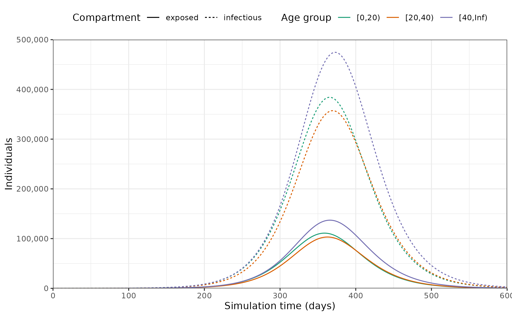

# Getting started with epidemic scenario modelling components

This initial vignette shows to get started with using the *epidemics*
package.

Further vignettes include guidance on [“Modelling the implementation of
vaccination
regimes”](https://epiverse-trace.github.io/epidemics/articles/modelling_vaccination.md),
as well as on[“Modelling non-pharmaceutical interventions (NPIs) to
reduce social
contacts”](https://epiverse-trace.github.io/epidemics/articles/modelling_interventions.md)
and [“Modelling multiple overlapping
NPIs”](https://epiverse-trace.github.io/epidemics/articles/modelling_multiple_interventions.md).

There is also guidance available on specific models in the model
library, such as the [Vacamole model developed by RIVM, the Dutch
Institute for Public
Health](https://epiverse-trace.github.io/epidemics/articles/model_vacamole.md).

``` r

library(epidemics)
library(dplyr)
#> 
#> Attaching package: 'dplyr'
#> The following objects are masked from 'package:stats':
#> 
#>     filter, lag
#> The following objects are masked from 'package:base':
#> 
#>     intersect, setdiff, setequal, union
library(ggplot2)
```

## Prepare population and initial conditions

Prepare population and contact data.

### Note on social contacts data

**Note that** the social contacts matrices provided by the
[*socialmixr*](https://CRAN.R-project.org/package=socialmixr) package
follow a format wherein the matrix $`M_{ij}`$ represents [contacts from
group $`i`$ to group
$`j`$](https://epiforecasts.io/socialmixr/articles/socialmixr.html#usage).

However, epidemic models traditionally adopt the notation that
$`M_{ij}`$ defines contacts to $`i`$ from $`j`$([Wallinga et al.
2006](#ref-wallinga2006)).

$`q M_{ij} / n_i`$ then defines the probability of infection, where
$`q`$ is a scaling factor dependent on $`R_0`$ (or another measure of
infection transmissibility), and $`n_i`$ is the population proportion of
group $`i`$. The ODEs in *epidemics* also follow this convention.

For consistency with this notation, social contact matrices from
*socialmixr* need to be transposed (using
[`t()`](https://rdrr.io/r/base/t.html)) before they are used with
*epidemics*.

``` r

# load contact and population data from socialmixr::polymod
polymod <- socialmixr::polymod
contact_data <- socialmixr::contact_matrix(
  polymod,
  countries = "United Kingdom",
  age_limits = c(0, 20, 40),
  symmetric = TRUE,
  return_demography = TRUE
)
#> Warning: Automatic country population lookup in `contact_matrix()` was deprecated in
#> socialmixr 0.6.0.
#> When `countries` is given (or a `country` column is present) without
#> `survey_pop`, contact_matrix() currently calls the soft-deprecated `wpp_age()`
#> to look up population data. This automatic lookup will be removed in a future
#> release: callers will then have to supply `survey_pop` whenever `symmetric`,
#> `split`, `per_capita`, `weigh_age`, or `return_demography` is TRUE.
#> ℹ Pass `survey_pop` explicitly to silence this warning, e.g. `survey_pop =
#>   survey_country_population(survey, countries)` or a data frame from the
#>   wpp2024 package.
#> This warning is displayed once per session.
#> Call `lifecycle::last_lifecycle_warnings()` to see where this warning was
#> generated.

# prepare contact matrix
contact_matrix <- t(contact_data$matrix)

# prepare the demography vector
demography_vector <- contact_data$demography$population
names(demography_vector) <- rownames(contact_matrix)

# view contact matrix and demography
contact_matrix
#>                  age.group
#> contact.age.group   [0,20)  [20,40) [40,Inf)
#>          [0,20)   7.883663 2.794154 1.565665
#>          [20,40)  3.120220 4.854839 2.624868
#>          [40,Inf) 3.063895 4.599893 5.005571

demography_vector
#>   [0,20)  [20,40) [40,Inf) 
#> 14799290 16526302 28961159
```

Prepare initial conditions for each age group.

``` r

# initial conditions
initial_i <- 1e-6
initial_conditions <- c(
  S = 1 - initial_i, E = 0, I = initial_i, R = 0, V = 0
)

# build for all age groups
initial_conditions <- rbind(
  initial_conditions,
  initial_conditions,
  initial_conditions
)

# assign rownames for clarity
rownames(initial_conditions) <- rownames(contact_matrix)

# view initial conditions
initial_conditions
#>                 S E     I R V
#> [0,20)   0.999999 0 1e-06 0 0
#> [20,40)  0.999999 0 1e-06 0 0
#> [40,Inf) 0.999999 0 1e-06 0 0
```

Prepare a population as a `population` class object.

``` r

uk_population <- population(
  name = "UK",
  contact_matrix = contact_matrix,
  demography_vector = demography_vector,
  initial_conditions = initial_conditions
)

uk_population
#> <population> object
#> 
#>  Population name: 
#> "UK"
#> 
#>  Demography 
#> [0,20): 14,799,290 (20%)
#> [20,40): 16,526,302 (30%)
#> [40,Inf): 28,961,159 (50%)
#> 
#>  Contact matrix 
#>                  age.group
#> contact.age.group   [0,20)  [20,40) [40,Inf)
#>          [0,20)   7.883663 2.794154 1.565665
#>          [20,40)  3.120220 4.854839 2.624868
#>          [40,Inf) 3.063895 4.599893 5.005571
#> 
#>  Initial Conditions 
#>                 S E     I R V
#> [0,20)   0.999999 0 1e-06 0 0
#> [20,40)  0.999999 0 1e-06 0 0
#> [40,Inf) 0.999999 0 1e-06 0 0
```

## Run epidemic model

``` r

# run an epidemic model using `epidemic`
output <- model_default(
  population = uk_population,
  time_end = 600, increment = 1.0
)
```

## Prepare data and visualise infections

Plot epidemic over time, showing only the number of individuals in the
exposed and infected compartments.

``` r

# plot figure of epidemic curve
filter(output, compartment %in% c("exposed", "infectious")) |>
  ggplot(
    aes(
      x = time,
      y = value,
      col = demography_group,
      linetype = compartment
    )
  ) +
  geom_line() +
  scale_y_continuous(
    labels = scales::comma
  ) +
  scale_colour_brewer(
    palette = "Dark2",
    name = "Age group"
  ) +
  expand_limits(
    y = c(0, 500e3)
  ) +
  coord_cartesian(
    expand = FALSE
  ) +
  theme_bw() +
  theme(
    legend.position = "top"
  ) +
  labs(
    x = "Simulation time (days)",
    linetype = "Compartment",
    y = "Individuals"
  )
```



## References

Wallinga, Jacco, Peter Teunis, and Mirjam Kretzschmar. 2006. “Using Data
on Social Contacts to Estimate Age-Specific Transmission Parameters for
Respiratory-Spread Infectious Agents.” *American Journal of
Epidemiology* 164 (10): 936–44. <https://doi.org/10.1093/aje/kwj317>.
