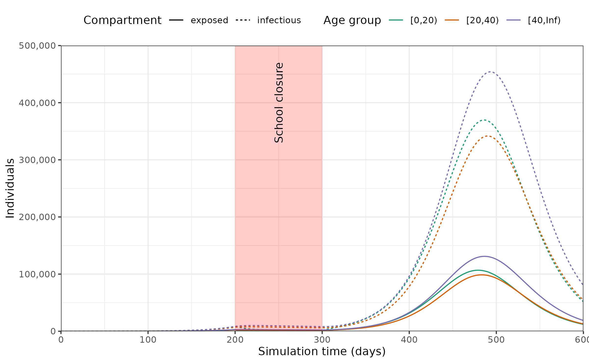

# Getting started with modelling interventions targeting social contacts

``` r

library(epidemics)
library(dplyr)
#> 
#> Attaching package: 'dplyr'
#> The following objects are masked from 'package:stats':
#> 
#>     filter, lag
#> The following objects are masked from 'package:base':
#> 
#>     intersect, setdiff, setequal, union
library(ggplot2)
```

## Prepare population and initial conditions

Prepare population and contact data.

### Note on social contacts data

*epidemics* expects social contacts matrices $`M_{ij}`$ to represent
contacts to $`i`$ from $`j`$([Wallinga et al. 2006](#ref-wallinga2006)),
such that $`q M_{ij} / n_i`$ is the probability of infection, where
$`q`$ is a scaling factor dependent on infection transmissibility, and
$`n_i`$ is the population proportion of group $`i`$.

Social contacts matrices provided by the
[*socialmixr*](https://CRAN.R-project.org/package=socialmixr) package
follow the opposite convention, where $`M_{ij}`$ represents [contacts
from group $`i`$ to group
$`j`$](https://epiforecasts.io/socialmixr/articles/socialmixr.html#usage).

Thus social contact matrices from *socialmixr* need to be transposed
(using [`t()`](https://rdrr.io/r/base/t.html)) before they are used with
*epidemics*.

``` r

# load contact and population data from socialmixr::polymod
polymod <- socialmixr::polymod
contact_data <- socialmixr::contact_matrix(
  polymod,
  countries = "United Kingdom",
  age_limits = c(0, 20, 40),
  symmetric = TRUE,
  return_demography = TRUE
)
#> Warning: Automatic country population lookup in `contact_matrix()` was deprecated in
#> socialmixr 0.6.0.
#> When `countries` is given (or a `country` column is present) without
#> `survey_pop`, contact_matrix() currently calls the soft-deprecated `wpp_age()`
#> to look up population data. This automatic lookup will be removed in a future
#> release: callers will then have to supply `survey_pop` whenever `symmetric`,
#> `split`, `per_capita`, `weigh_age`, or `return_demography` is TRUE.
#> ℹ Pass `survey_pop` explicitly to silence this warning, e.g. `survey_pop =
#>   survey_country_population(survey, countries)` or a data frame from the
#>   wpp2024 package.
#> This warning is displayed once per session.
#> Call `lifecycle::last_lifecycle_warnings()` to see where this warning was
#> generated.

# prepare contact matrix
contact_matrix <- t(contact_data$matrix)

# prepare the demography vector
demography_vector <- contact_data$demography$population
names(demography_vector) <- rownames(contact_matrix)
```

Prepare initial conditions for each age group.

``` r

# initial conditions
initial_i <- 1e-6
initial_conditions <- c(
  S = 1 - initial_i, E = 0, I = initial_i, R = 0, V = 0
)

# build for all age groups
initial_conditions <- rbind(
  initial_conditions,
  initial_conditions,
  initial_conditions
)

# assign rownames for clarity
rownames(initial_conditions) <- rownames(contact_matrix)
```

Prepare a population as a `population` class object.

``` r

uk_population <- population(
  name = "UK",
  contact_matrix = contact_matrix,
  demography_vector = demography_vector,
  initial_conditions = initial_conditions
)
```

## Prepare an intervention

Prepare an intervention to simulate school closures.

``` r

# prepare an intervention with a differential effect on age groups
close_schools <- intervention(
  name = "School closure",
  type = "contacts",
  time_begin = 200,
  time_end = 300,
  reduction = matrix(c(0.5, 0.001, 0.001))
)

# examine the intervention object
close_schools
#> <contacts_intervention> object
#> 
#>  Intervention name: 
#> "School closure"
#> 
#>  Begins at: 
#> [1] 200
#> 
#>  Ends at: 
#> [1] 300
#> 
#>  Reduction: 
#>              Interv. 1
#> Demo. grp. 1     0.500
#> Demo. grp. 2     0.001
#> Demo. grp. 3     0.001
```

## Run epidemic model

``` r

# run an epidemic model using `epidemic`
output <- model_default(
  population = uk_population,
  intervention = list(contacts = close_schools),
  time_end = 600, increment = 1.0
)
```

## Prepare data and visualise infections

Plot epidemic over time, showing only the number of individuals in the
exposed and infected compartments.

``` r

# plot figure of epidemic curve
filter(output, compartment %in% c("exposed", "infectious")) |>
  ggplot(
    aes(
      x = time,
      y = value,
      col = demography_group,
      linetype = compartment
    )
  ) +
  geom_line() +
  annotate(
    geom = "rect",
    xmin = close_schools$time_begin,
    xmax = close_schools$time_end,
    ymin = 0, ymax = 500e3,
    fill = alpha("red", alpha = 0.2),
    lty = "dashed"
  ) +
  annotate(
    geom = "text",
    x = mean(c(close_schools$time_begin, close_schools$time_end)),
    y = 400e3,
    angle = 90,
    label = "School closure"
  ) +
  scale_y_continuous(
    labels = scales::comma
  ) +
  scale_colour_brewer(
    palette = "Dark2",
    name = "Age group"
  ) +
  expand_limits(
    y = c(0, 500e3)
  ) +
  coord_cartesian(
    expand = FALSE
  ) +
  theme_bw() +
  theme(
    legend.position = "top"
  ) +
  labs(
    x = "Simulation time (days)",
    linetype = "Compartment",
    y = "Individuals"
  )
```



## References

Wallinga, Jacco, Peter Teunis, and Mirjam Kretzschmar. 2006. “Using Data
on Social Contacts to Estimate Age-Specific Transmission Parameters for
Respiratory-Spread Infectious Agents.” *American Journal of
Epidemiology* 164 (10): 936–44. <https://doi.org/10.1093/aje/kwj317>.
