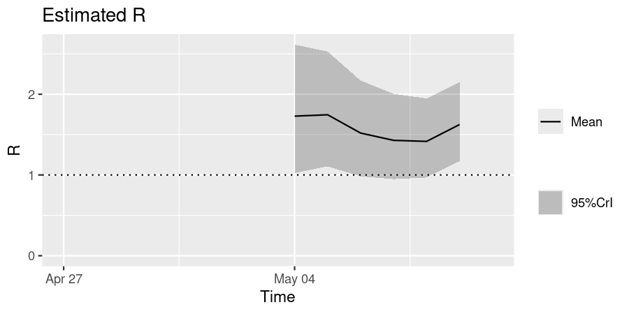
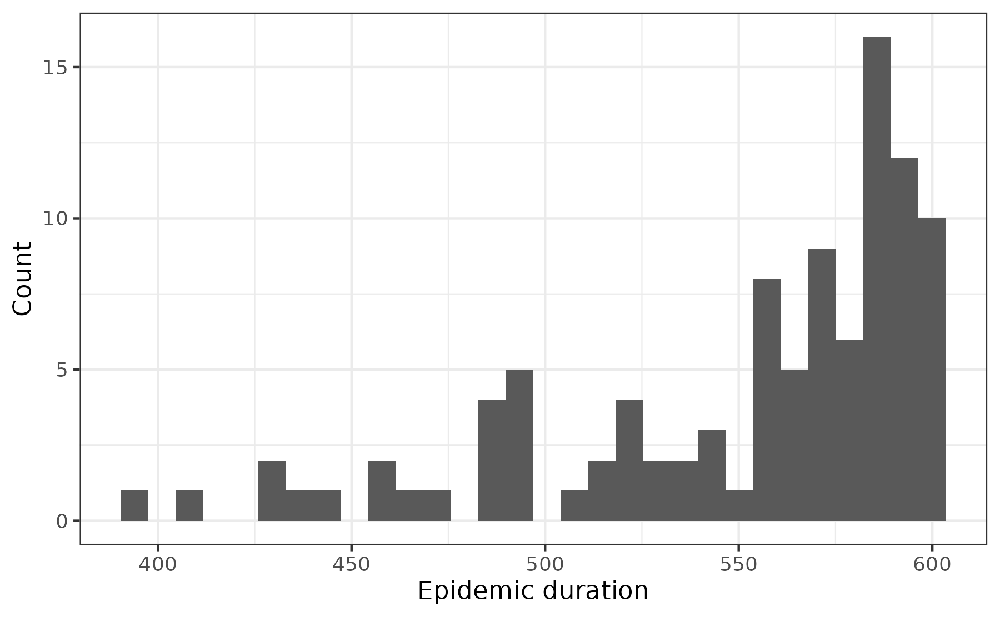

# Modelling parameter uncertainty

**New to *epidemics*?** It may help to read the [“Get
started”](https://epiverse-trace.github.io/epidemics/articles/epidemics.md)
vignette first!

This vignette shows how *epidemics* can conveniently be used to include
parameter uncertainty in an epidemic model.

``` r

# epi modelling
library(epidemics)
library(EpiEstim) # for Rt estimation

# data manipulation packages
library(dplyr)
library(tidyr)
library(purrr)
library(ggplot2)
library(colorspace)

# for reproducibility
library(withr)
```

## Modelling parameter uncertainty

Uncertainty in the characteristics of an epidemic is a key element and
roadblock in epidemic response ([Shea et al. 2020](#ref-shea2020)).
Epidemic dynamics can be influenced by two main sources of uncertainty:
intrinsic randomness in the transmission process, and uncertain
knowledge of the parameters underlying the transmission process. Here we
focus on the latter, i.e. uncertainty in the input parameters of an
epidemic model.

*epidemics* model functions can accept numeric vectors for all infection
parameters; the model is run for each parameter combination using the
same population and other model components (interventions, vaccinations)
etc. This allows users to quickly obtain results for a range of
parameter values without having to repeatedly call `model_*()` in a loop
or similar; this iteration is performed internally.

Some benefits of vectorising inputs:

- Inputs are checked all at once, rather than $`N`$ times for each
  element of the parameter vector — this improves performance over
  manual iteration;

- Model output is organised to make filtering by parameter values and
  scenarios easier (more on this below).

**Note that** it is always possible to pass a single value of any
infection parameter. Single values may be referred to as “scalar” values
or “scalars”. Passing scalar infection parameters will yield a simple
table of the model “time”, “demography group”, “compartment”, and
“value”, for the number of individuals in each demographic group in each
compartment at each model time point.

Click on “Code” below to see the hidden code used to set up a population
in this vignette. For more details on how to define populations and
initial model conditions please see the [“Getting started with epidemic
scenario modelling
components”](https://epiverse-trace.github.io/epidemics/articles/epidemics.md)
vignette. In brief, we model the U.K. population with three age groups,
0 – 19, 20 – 39, \> 40, and social contacts stratified by age.

``` r

# load contact and population data from socialmixr::polymod
polymod <- socialmixr::polymod

# demography data from the wpp2024 package
data("popAge1dt", package = "wpp2024")
uk_pop <- popAge1dt |>
  dplyr::filter(name == "United Kingdom", year == 2006) |>
  dplyr::select(lower.age.limit = age, population = pop) |>
  dplyr::mutate(population = population * 1000)

contact_data <- socialmixr::contact_matrix(
  polymod,
  countries = "United Kingdom",
  survey_pop = uk_pop,
  age_limits = c(0, 20, 40),
  symmetric = TRUE,
  return_demography = TRUE
)

# prepare contact matrix
contact_matrix <- t(contact_data$matrix)

# prepare the demography vector
demography_vector <- contact_data$demography$population
names(demography_vector) <- rownames(contact_matrix)

# initial conditions
initial_i <- 1e-6
initial_conditions <- c(
  S = 1 - initial_i, E = 0, I = initial_i, R = 0, V = 0
)

# build for all age groups
initial_conditions <- rbind(
  initial_conditions,
  initial_conditions,
  initial_conditions
)
# assign rownames for clarity
rownames(initial_conditions) <- rownames(contact_matrix)
```

``` r

# UK population created from hidden code
uk_population <- population(
  name = "UK",
  contact_matrix = contact_matrix,
  demography_vector = demography_vector,
  initial_conditions = initial_conditions
)
```

### Obtaining estimates of disease transmission rate

For this example, we consider influenza with pandemic potential ([Ghani
et al. 2010](#ref-ghani2010)), and prepare multiple samples of the
estimated $`R`$. This reflects pandemic response scenarios in which
$`R`$ estimates always come with some uncertainty (due to limitations in
the data and estimation methods). Sampling from a distribution that
$`R`$ is expected to follow allows us to better understand the extent of
variance in possible epidemic outcomes.

We obtain the probability distribution function (PDF) from the
distribution of the serial intervals; this is a Gamma distribution with
shape $`k`$ = 2.622 and scale $`\theta`$ = 0.957 ([Ghani et al.
2010](#ref-ghani2010)).

The [forthcoming Epiverse package
*epiparameter*](https://epiverse-trace.github.io/epiparameter/) is
expected to make it substantially easier to access and use
epidemiological parameters, such as the serial interval, reported in the
literature, making it easier to model scenarios differing in the
intrinsic characteristics of the pathogen causing the outbreak.

We use this PDF to estimate the $`R`$ of the 2009 influenza pandemic in
the U.K., using [the *EpiEstim*
package](https://cran.r-project.org/package=EpiEstim). We use the $`R`$
estimate (the mean and standard deviation) from *EpiEstim* to generate
100 samples of $`R`$, assuming that it is normally distributed. Users
who are drawing parameters with greater variance may wish to draw a
larger number of samples.

``` r

# Get 2009 influenza data for school in Pennsylvania
data(Flu2009)
flu_early_data <- filter(Flu2009$incidence, dates < "2009-05-10")

# get the PDF of the distribution of serial intervals
serial_pdf <- dgamma(seq(0, 25), shape = 2.622, scale = 0.957)
# ensure probabilities add up to 1 by normalising them by the sum
serial_pdf <- serial_pdf / sum(serial_pdf)

# Use EpiEstim to estimate R with uncertainty
# Uses Gamma distribution by default
output_R <- estimate_R(
  incid = flu_early_data,
  method = "non_parametric_si",
  config = make_config(list(si_distr = serial_pdf))
)

# Plot output to visualise
plot(output_R, "R")
```



### Passing a vector of transmission rates

Here, we generate 100 samples of $`R`$, and convert to the transmission
rate (often denoted $`\beta`$) by dividing by the infectious period of 7
days.

Since *EpiEstim* estimates $`Rt`$, the instantaneous $`R`$, we shall use
the mean of the estimates over the time period, and the mean of the
standard deviation, as parameters for a distribution from which to draw
$`R`$ samples for the model.

``` r

# get mean mean and sd over time
r_estimate_mean <- mean(output_R$R$`Mean(R)`)
r_estimate_sd <- mean(output_R$R$`Std(R)`)

# Generate 100 R samples
r_samples <- with_seed(
  seed = 1,
  rnorm(
    n = 100, mean = r_estimate_mean, sd = r_estimate_sd
  )
)

infectious_period <- 7
beta <- r_samples / infectious_period
```

``` r

# pass the vector of transmissibilities to the argument `transmission_rate`
output <- model_default(
  population = uk_population,
  transmission_rate = beta,
  time_end = 600
)

# view the output
head(output)
#>    transmission_rate infectiousness_rate recovery_rate time_end param_set
#>                <num>               <num>         <num>    <num>     <int>
#> 1:         0.1977482                 0.5     0.1428571      600         1
#> 2:         0.2333557                 0.5     0.1428571      600         2
#> 3:         0.1885540                 0.5     0.1428571      600         3
#> 4:         0.2954036                 0.5     0.1428571      600         4
#> 5:         0.2397671                 0.5     0.1428571      600         5
#> 6:         0.1892204                 0.5     0.1428571      600         6
#>         population intervention vaccination time_dependence increment scenario
#>             <list>       <list>      <list>          <list>     <num>    <int>
#> 1: <population[4]>       [NULL]      [NULL]       <list[1]>         1        1
#> 2: <population[4]>       [NULL]      [NULL]       <list[1]>         1        1
#> 3: <population[4]>       [NULL]      [NULL]       <list[1]>         1        1
#> 4: <population[4]>       [NULL]      [NULL]       <list[1]>         1        1
#> 5: <population[4]>       [NULL]      [NULL]       <list[1]>         1        1
#> 6: <population[4]>       [NULL]      [NULL]       <list[1]>         1        1
#>                    data
#>                  <list>
#> 1: <data.table[9015x4]>
#> 2: <data.table[9015x4]>
#> 3: <data.table[9015x4]>
#> 4: <data.table[9015x4]>
#> 5: <data.table[9015x4]>
#> 6: <data.table[9015x4]>
```

The output is a nested `<data.table>`, with the output of each run of
the model for each unique `transmission_rate` contained as a
`<data.frame>` in the list column `"data"`.

### Output type for vector parameter inputs

The output of `model_*()` when an infection parameter is passed as a
vector is a nested `<data.table>`. This is similar to a nested
`<tibble>`, and can be handled by popular data science packages, such as
from the Tidyverse.

More on handling nested data can be found in this [section on
list-columns in R for Data
Science](https://r4ds.hadley.nz/rectangling.html#list-columns) and in
the [documentation for nested data in the *tidyr*
package](https://tidyr.tidyverse.org/articles/nest.html). Equivalent
operations are possible on `<data.table>`s directly; see [this R
Bloggers post on unnesting
data](https://www.r-bloggers.com/2019/10/much-faster-unnesting-with-data-table/).

We unnest the output’s “data” column in order to plot incidence curves
for each transmission rate value.

``` r

# select the parameter set and data columns with dplyr::select()
# add the R value for visualisation
# calculate new infections, and use tidyr to unnest the data column
data <- select(output, param_set, transmission_rate, data) |>
  mutate(
    r_value = r_samples,
    new_infections = map(data, new_infections)
  ) |>
  select(-data) |>
  unnest(new_infections)
```

``` r

# plot the data
filter(data) |>
  ggplot() +
  geom_line(
    aes(time, new_infections, col = r_value, group = param_set),
    alpha = 0.3
  ) +
  # use qualitative scale to emphasize differences
  scale_colour_fermenter(
    palette = "Dark2",
    name = "R",
    breaks = c(0, 1, 1.5, 2.0, 3.0),
    limits = c(0, 3)
  ) +
  scale_y_continuous(
    name = "New infections",
    labels = scales::label_comma(scale = 1e-3, suffix = "K")
  ) +
  labs(
    x = "Time (days since start of epidemic)"
  ) +
  facet_grid(
    cols = vars(demography_group)
  ) +
  theme_bw() +
  theme(
    legend.position = "top",
    legend.key.height = unit(2, "mm")
  )
```

![Incidence curves for the number of new infections on each day of the
epidemic given uncertainty in the R estimate; colours indicate \$R\$
bins. Larger \$R\$ values lead to shorter epidemics with higher peaks,
while lower R values lead to more spread out epidemics with lower peaks.
Epidemics with \$R\$ \< 1.0 do not 'take off' and are not clearly
visible. Linking incidence curves to their \$R\$ values in a plot allows
a quick visual assessment of the potential outcomes of an epidemic whose
\$R\$ is
uncertain.](modelling_param_uncertainty_files/figure-html/unnamed-chunk-8-1.png)

Incidence curves for the number of new infections on each day of the
epidemic given uncertainty in the R estimate; colours indicate $`R`$
bins. Larger $`R`$ values lead to shorter epidemics with higher peaks,
while lower R values lead to more spread out epidemics with lower peaks.
Epidemics with $`R`$ \< 1.0 do not ‘take off’ and are not clearly
visible. Linking incidence curves to their $`R`$ values in a plot allows
a quick visual assessment of the potential outcomes of an epidemic whose
$`R`$ is uncertain.

### Passing parameter sets

*epidemics* model functions can accept multiple infection parameters as
vectors, so long as any vectors are all of the same length, or of length
1 (scalar values) as shown below.

``` r

beta <- rnorm(n = 100, mean, sd)
gamma <- rnorm(n = 100, mean, sd) # the recovery rate

model_default(
  population,
  transmission_rate = beta, # same length as gamma
  infectiousness_rate = 0.5, # length 1
  recovery_rate = gamma
)
```

### Passing vectors of epidemic duration

*epidemics* allows the duration of an model run to be varied, as this
may be useful when examining how variation in the start time of an
epidemic affects outcomes by a fixed end point. This example shows how
to estimate potential variation in the final epidemic size over a range
of epidemic start times (and hence durations, assuming a fixed end).

``` r

# draw samples of time_end
max_time <- 600
duration <- max_time - with_seed(seed = 1, {
  rnbinom(100, 1, 0.02)
})
```

``` r

# view durations
ggplot() +
  geom_histogram(aes(duration)) +
  theme_bw() +
  labs(
    x = "Epidemic duration",
    y = "Count"
  )
```



``` r

# pass the vector of durations to `time_end`
output <- model_default(
  population = uk_population,
  time_end = duration
)

# view the output
head(output)
#>    transmission_rate infectiousness_rate recovery_rate time_end param_set
#>                <num>               <num>         <num>    <num>     <int>
#> 1:         0.1857143                 0.5     0.1428571      589         1
#> 2:         0.1857143                 0.5     0.1428571      595         2
#> 3:         0.1857143                 0.5     0.1428571      568         3
#> 4:         0.1857143                 0.5     0.1428571      583         4
#> 5:         0.1857143                 0.5     0.1428571      589         5
#> 6:         0.1857143                 0.5     0.1428571      593         6
#>         population intervention vaccination time_dependence increment scenario
#>             <list>       <list>      <list>          <list>     <num>    <int>
#> 1: <population[4]>       [NULL]      [NULL]       <list[1]>         1        1
#> 2: <population[4]>       [NULL]      [NULL]       <list[1]>         1        1
#> 3: <population[4]>       [NULL]      [NULL]       <list[1]>         1        1
#> 4: <population[4]>       [NULL]      [NULL]       <list[1]>         1        1
#> 5: <population[4]>       [NULL]      [NULL]       <list[1]>         1        1
#> 6: <population[4]>       [NULL]      [NULL]       <list[1]>         1        1
#>                    data
#>                  <list>
#> 1: <data.table[8850x4]>
#> 2: <data.table[8940x4]>
#> 3: <data.table[8535x4]>
#> 4: <data.table[8760x4]>
#> 5: <data.table[8850x4]>
#> 6: <data.table[8910x4]>
```

**NOTE:** When the duration of the model runs is varied, each model
output will have a potentially distinct number of rows.

``` r

# calculate the epidemic size to view the mean and SD of sizes
epidemic_size_estimates <- select(output, param_set, data) |>
  mutate(
    size = map(data, function(x) {
      tibble(
        demography_group = unique(x$demography_group),
        size = epidemic_size(x)
      )
    })
  ) |>
  select(size) |>
  unnest(size) |>
  summarise(
    across(size, .fns = c(mean = mean, sd = sd)),
    .by = "demography_group"
  )
```

``` r

# view the range of epidemic sizes
range(epidemic_size_estimates$size)
#> [1]  Inf -Inf
```

## References

Ghani, Azra, Marc Baguelin, Jamie Griffin, et al. 2010. “The Early
Transmission Dynamics of H1N1pdm Influenza in the United Kingdom.” *PLoS
Currents* 1 (June): RRN1130. <https://doi.org/10.1371/currents.RRN1130>.

Shea, Katriona, Ottar N. Bjørnstad, Martin Krzywinski, and Naomi Altman.
2020. “Uncertainty and the Management of Epidemics.” *Nature Methods* 17
(9): 9. <https://doi.org/10.1038/s41592-020-0943-4>.
