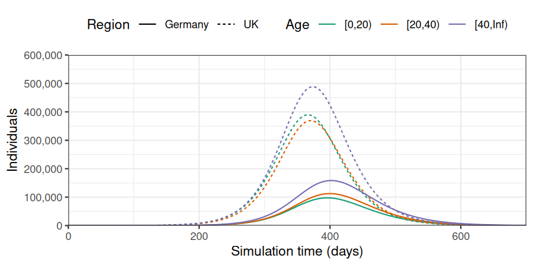
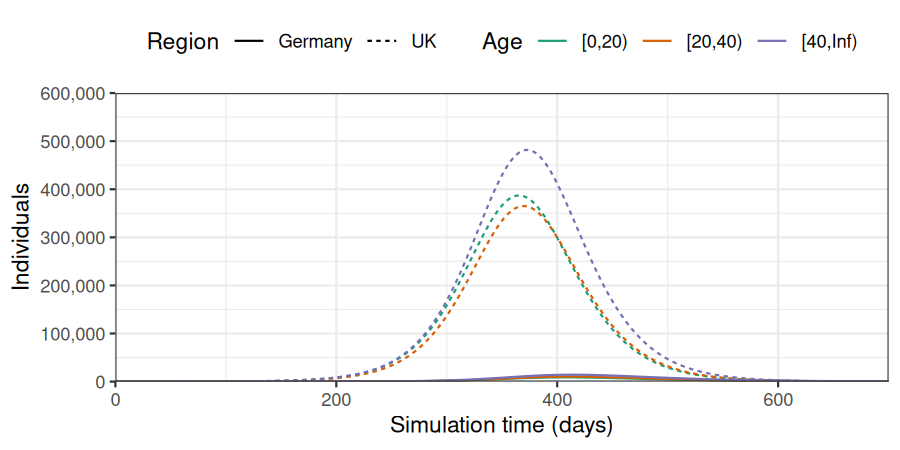
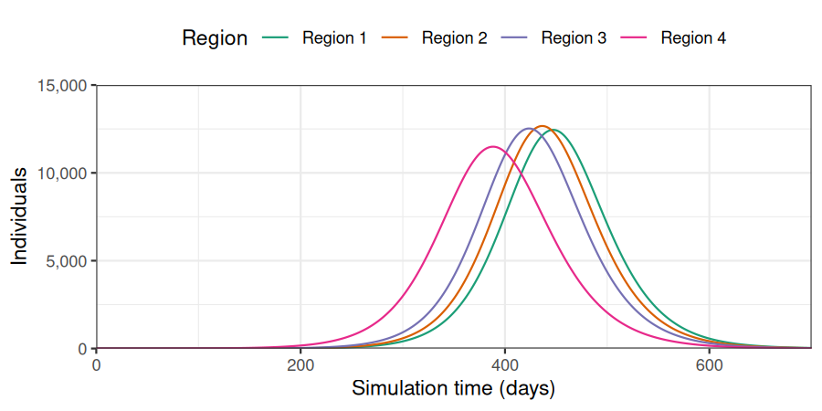

# Modelling in multiple populations

**New to *epidemics*?** It may help to read the [“Get
started”](https://epiverse-trace.github.io/epidemics/articles/epidemics.md)
vignette first!

This vignette shows how *epidemics* can be used to combine multiple
age-stratified populations into an epidemic model.

Code

``` r

library(epidemics)
library(dplyr)
#> 
#> Attaching package: 'dplyr'
#> The following objects are masked from 'package:stats':
#> 
#>     filter, lag
#> The following objects are masked from 'package:base':
#> 
#>     intersect, setdiff, setequal, union
library(ggplot2)
```

## Combining two populations

We prepare two age-stratified populations: one using the contact data
and demography from the UK, and the other using the contact data and
demography from Germany. The epidemiological compartments match the
default epidemic model (SEIR-V).

We assume that one in every million people has been infected and is
infectious in the United Kingdom, while all the population in Germany is
susceptible.

The code for these steps is similar to that in the [“Getting started
vignette”](https://epiverse-trace.github.io/epidemics/articles/epidemics.md).

First, we define the contact data, demography, and set initial
conditions for the first population, and create the corresponding
population object.

Code

``` r

# load contact and population data from socialmixr::polymod
polymod <- socialmixr::polymod

# demography data from the wpp2024 package
data("popAge1dt", package = "wpp2024")
uk_pop <- popAge1dt |>
  dplyr::filter(name == "United Kingdom", year == 2006) |>
  dplyr::select(lower.age.limit = age, population = pop) |>
  dplyr::mutate(population = population * 1000)

contact_data1 <- socialmixr::contact_matrix(
  polymod,
  countries = "United Kingdom",
  survey_pop = uk_pop,
  age_limits = c(0, 20, 40),
  symmetric = TRUE,
  return_demography = TRUE
)

# prepare contact matrix
contact_matrix1 <- t(contact_data1$matrix)

# prepare the demography vector
demography_vector1 <- contact_data1$demography$population
names(demography_vector1) <- rownames(contact_matrix1)

# view contact matrix and demography
contact_matrix1
#>                  age.group
#> contact.age.group   [0,20)  [20,40) [40,Inf)
#>          [0,20)   7.883663 2.764179 1.557728
#>          [20,40)  3.157024 4.854839 2.636148
#>          [40,Inf) 3.084747 4.570735 5.005571

demography_vector1
#>   [0,20)  [20,40) [40,Inf) 
#> 14865748 16978469 29438434
```

Code

``` r

# initial conditions
initial_i <- 1e-6
initial_condition1 <- c(
  S = 1 - initial_i, E = 0, I = initial_i, R = 0, V = 0
)

# build for all age groups
initial_conditions1 <- rbind(
  initial_condition1,
  initial_condition1,
  initial_condition1
)

# assign rownames for clarity
rownames(initial_conditions1) <- rownames(contact_matrix1)
```

Code

``` r

population1 <- population(
  name = "UK",
  contact_matrix = contact_matrix1,
  demography_vector = demography_vector1,
  initial_conditions = initial_conditions1
)
```

Then, we define the contact data, demography, and initial conditions for
the second population, and create the corresponding population object.

Code

``` r

germany_pop <- popAge1dt |>
  dplyr::filter(name == "Germany", year == 2006) |>
  dplyr::select(lower.age.limit = age, population = pop) |>
  dplyr::mutate(population = population * 1000)

contact_data2 <- socialmixr::contact_matrix(
  polymod,
  countries = "Germany",
  survey_pop = germany_pop,
  age_limits = c(0, 20, 40),
  symmetric = TRUE,
  return_demography = TRUE
)
contact_matrix2 <- t(contact_data2$matrix)
demography_vector2 <- contact_data2$demography$population
names(demography_vector2) <- rownames(contact_matrix2)

# build for all age groups
initial_condition2 <- c(
  S = 1, E = 0, I = 0, R = 0, V = 0
)

initial_conditions2 <- rbind(
  initial_condition2,
  initial_condition2,
  initial_condition2
)

population2 <- population(
  name = "Germany",
  contact_matrix = contact_matrix2,
  demography_vector = demography_vector2,
  initial_conditions = initial_conditions2
)
```

We define `prop_matrix`, the connectivity matrix between the two
populations (United Kingdom and Germany). In this first example, the
rate of connections between the population is 5% that of the rate of
connection in each population.

Code

``` r

# Set connectivity matrix between population1 and population2
prop_matrix <- matrix(c(1, 0.05, 0.05, 1), nrow = 2, ncol = 2)
```

We then use the function `combine_populations` to combine the two
populations. The resulting population object will contain 6 strata (3
age groups in each population). If the method is defined as `"linear"`,
the contact rate between groups is computed as the product between the
contact matrix between groups and the connectivity between populations.

### Note on connectivity matrix

The contact matrix element of the combined population contains the
number of connections between each group of all the populations listed
in the `populations` argument. More than two populations can be
combined, and the populations should all contain the same demographic
groups. The number of contacts between groups from the same populations
is computed from the `contact_matrix`. The number of contacts between
groups from different populations is computed from the
`connectivity_matrix` argument. Different methods can be used to compute
the number of contacts between groups from different populations. If
`method` is linear, the number of contacts between groups of different
population is computed as the product of the connectivity between the
two populations (in `connectivity_matrix`) and the number of contacts
between groups in the population of origin.

Code

``` r

# Combine populations
tot_population <- combine_populations(
  populations = list(population1, population2),
  connectivity_matrix = prop_matrix,
  method = "linear",
  name = "combine"
)
tot_population$contact_matrix
#>                  UK_[0,20) UK_[20,40) UK_[40,Inf) Germany_[0,20)
#> UK_[0,20)        7.8836634  2.7641785   1.5577281     0.21987654
#> UK_[20,40)       3.1570238  4.8548387   2.6361484     0.09597109
#> UK_[40,Inf)      3.0847473  4.5707349   5.0055710     0.12991787
#> Germany_[0,20)   0.3941832  0.1382089   0.0778864     4.39753086
#> Germany_[20,40)  0.1578512  0.2427419   0.1318074     1.91942171
#> Germany_[40,Inf) 0.1542374  0.2285367   0.2502786     2.59835740
#>                  Germany_[20,40) Germany_[40,Inf)
#> UK_[0,20)             0.07529881       0.04678915
#> UK_[20,40)            0.21123418       0.07848854
#> UK_[40,Inf)           0.17099275       0.20370036
#> Germany_[0,20)        1.50597616       0.93578298
#> Germany_[20,40)       4.22468354       1.56977082
#> Germany_[40,Inf)      3.41985500       4.07400722
```

The object `tot_population` contains 6 groups: UK population aged 0-20
years old, 20-40 year old, and \>40 years old; and German population
aged 0-20 years old, 20-40 year old, and \>40 years old.

We now use `model_default` to simulate the epidemic on the combined
population for 700 days, with transmission starting in the United
Kingdom.

Code

``` r

# run an epidemic model using `epidemic`
output <- model_default(
  population = tot_population,
  time_end = 700, increment = 1.0
)
```

We plot the data to observe the number of cases per region and age
group. In all age groups, the outbreaks starts and peaks later in
Germany than in the United Kingdom.

Code

``` r

# plot figure of epidemic curve
filter(output, compartment == "infectious") |>
  mutate(region = gsub("[_].*", "", demography_group),
         age = gsub(".*[_]", "", demography_group)) |>
  ggplot(
    aes(
      x = time,
      y = value,
      col = age,
      linetype = region
    )
  ) +
  geom_line() +
  scale_y_continuous(
    labels = scales::comma
  ) +
  scale_colour_brewer(
    palette = "Dark2",
    name = "Age"
  ) +
  expand_limits(
    y = c(0, 600e3)
  ) +
  coord_cartesian(
    expand = FALSE
  ) +
  theme_bw() +
  theme(
    legend.position = "top"
  ) +
  labs(
    x = "Simulation time (days)",
    linetype = "Region",
    y = "Individuals"
  )
```



## Combining two populations using a gravity model

When combining populations, the argument method can be set to “gravity”
to implement a gravity model instead, using the connectivity matrix as a
distance between regions. In this example, the populations are set to
200km away. The connectivity between regions is then computed from the
overall number of inhabitants in each region and the distance.

### Note on gravity connectivity matrix

If `method` is set to gravity, a gravity model is used to estimate the
number of connections between populations. For each population \\i\\ and
\\j\\, the number of connections is computed as \\C\_{ij} = \frac{N_i \*
N_j}{d\_{ij}}\\, with \\N_i\\ and \\N_j\\ the overall number of
inhabitants in each population, and \\d\_{ij}\\ the distance between
populations, taken from the `connectivity_matrix` argument. To avoid
large values, \\C\_{ij}\\ is divided by the maximum value of \\C\\. The
number of contacts between groups from different populations is computed
as the product of \\\frac{C_ij}{max(C)}\\ and the number of contacts
between groups in the population of origin.

Code

``` r

distance_matrix <- matrix(c(0, 200, 200, 0), nrow = 2, ncol = 2)

gravity_population <- combine_populations(
  populations = list(population1, population2),
  connectivity_matrix = distance_matrix,
  method = "gravity", name = "combine_gravity"
)

gravity_population$contact_matrix
#>                   UK_[0,20) UK_[20,40) UK_[40,Inf) Germany_[0,20)
#> UK_[0,20)        7.88366337 2.76417854 1.557728085    0.016556089
#> UK_[20,40)       3.15702376 4.85483871 2.636148384    0.007226354
#> UK_[40,Inf)      3.08474726 4.57073487 5.005571031    0.009782452
#> Germany_[0,20)   0.02968089 0.01040675 0.005864629    4.397530864
#> Germany_[20,40)  0.01188575 0.01827779 0.009924730    1.919421706
#> Germany_[40,Inf) 0.01161364 0.01720818 0.018845275    2.598357398
#>                  Germany_[20,40) Germany_[40,Inf)
#> UK_[0,20)             0.00566979      0.003523092
#> UK_[20,40)            0.01590534      0.005909968
#> UK_[40,Inf)           0.01287528      0.015338068
#> Germany_[0,20)        1.50597616      0.935782978
#> Germany_[20,40)       4.22468354      1.569770820
#> Germany_[40,Inf)      3.41985500      4.074007220
```

Code

``` r

# run an epidemic model
output_gravity <- model_default(
  population = gravity_population,
  time_end = 700, increment = 1.0
)
```

Given the distance between populations, the rate of connectivity between
the two populations is much lower than when we used `method = "linear"`.
Therefore, almost all cases are reported in the United Kingdom, with
rare transmission to Germany.

Code

``` r

# plot figure of epidemic curve
filter(output_gravity, compartment == "infectious") |>
  mutate(region = gsub("[_].*", "", demography_group),
         age = gsub(".*[_]", "", demography_group)) |>
  ggplot(
    aes(
      x = time,
      y = value,
      col = age,
      linetype = region
    )
  ) +
  geom_line() +
  scale_y_continuous(
    labels = scales::comma
  ) +
  scale_colour_brewer(
    palette = "Dark2",
    name = "Age"
  ) +
  expand_limits(
    y = c(0, 600e3)
  ) +
  coord_cartesian(
    expand = FALSE
  ) +
  theme_bw() +
  theme(
    legend.position = "top"
  ) +
  labs(
    x = "Simulation time (days)",
    linetype = "Region",
    y = "Individuals"
  )
```



The argument `method` can also be defined as a function, which will be
used to compute the connectivity matrix. Using
`method = gravity_contact` will lead to the same output as
`method = "gravity"`.

Code

``` r

gravity_pop_with_function <- combine_populations(
  populations = list(population1, population2),
  connectivity_matrix = distance_matrix,
  method = gravity_contact, name = "combine_gravity"
)

# run an epidemic model
output_gravity_with_function <- model_default(
  population = gravity_pop_with_function,
  time_end = 700, increment = 1.0
)

# Check function and "gravity" outputs are the same
all(output_gravity_with_function == output_gravity)
#> [1] TRUE
```

## Combining n populations using a gravity model

In this last example, the function `combine_population` is used to
combine more than 2 population objects. First we define a set of
population objects, with 0 infected and infectious cases at the start of
the simulations.

Code

``` r

n <- 4

all_population <- list()
for (i in seq_len(n - 1)){
  all_population[i] <- list(population(
    contact_matrix = contact_matrix1,
    demography_vector = demography_vector1 / 100,
    initial_conditions = rbind(
      c(S = 1, E = 0, I = 0, R = 0, V = 0),
      c(S = 1, E = 0, I = 0, R = 0, V = 0),
      c(S = 1, E = 0, I = 0, R = 0, V = 0)
    ),
    name = paste0("Region ", i)))
}
```

We then add one last population object to the `all_population` list,
with a few infectious individuals.

Code

``` r

all_population[n] <- list(population(
  contact_matrix = contact_matrix1,
  demography_vector = demography_vector1 / 100,
  initial_conditions = rbind(
    c(S = 1 - 1e-6, E = 0, I = 1e-6, R = 0, V = 0),
    c(S = 1 - 1e-6, E = 0, I = 1e-6, R = 0, V = 0),
    c(S = 1 - 1e-6, E = 0, I = 1e-6, R = 0, V = 0)
  ),
  name = paste0("Region ", n)))
```

Each population is placed on a line, with consecutive populations being
150km away (i.e. populations 1 and 2 are 150km away, 1 and 3 are 300km
away…).

Code

``` r

distance_matrix_n <-
  matrix(150 * abs(rep(seq_len(n), n) - rep(seq_len(n), each = n)), nrow = n)
distance_matrix_n
#>      [,1] [,2] [,3] [,4]
#> [1,]    0  150  300  450
#> [2,]  150    0  150  300
#> [3,]  300  150    0  150
#> [4,]  450  300  150    0
```

We combine all populations using a gravity model, and simulate an
epidemic using and SEIRV model.

Code

``` r

combined_n_populations <-
  combine_populations(
    populations = all_population,
    connectivity_matrix = distance_matrix_n,
    method = "gravity", name = "combine_gravity_n"
  )


# run an epidemic model
output_gravity_n <- model_default(
  population = combined_n_populations,
  time_end = 700, increment = 1.0
)
```

The outbreak first peaks in region 4, then in region 3, 2, and 1, with
similar number of cases.

Code

``` r

filter(output_gravity_n, compartment == "infectious") |>
  mutate(region = gsub("[_].*", "", demography_group),
         age = gsub(".*[_]", "", demography_group)) |>
  group_by(time, region) |>
  summarise(value = sum(value)) |>
  ggplot(
    aes(
      x = time,
      y = value,
      col = region
    )
  ) +
  geom_line() +
  scale_y_continuous(
    labels = scales::comma
  ) +
  scale_colour_brewer(
    palette = "Dark2",
    name = "Region"
  ) +
  expand_limits(
    y = c(0, 15e3)
  ) +
  coord_cartesian(
    expand = FALSE
  ) +
  theme_bw() +
  theme(
    legend.position = "top"
  ) +
  labs(
    x = "Simulation time (days)",
    linetype = "Region",
    y = "Individuals"
  )
#> `summarise()` has regrouped the output.
#> Ignoring unknown labels: • linetype : "Region"
#> ℹ Summaries were computed grouped by time and region.
#> ℹ Output is grouped by time.
#> ℹ Use `summarise(.groups = "drop_last")` to silence this message.
#> ℹ Use `summarise(.by = c(time, region))` for per-operation grouping
#>   (`?dplyr::dplyr_by`) instead.
```


