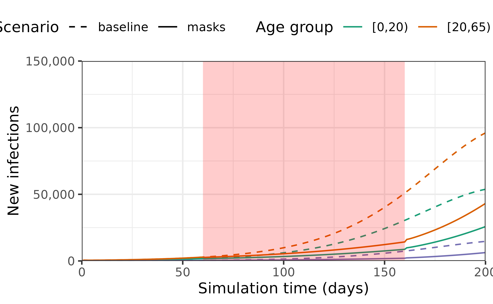

# Modelling interventions that change infection parameters

**New to *epidemics*, or to modelling interventions?** It may help to
read the [“Get
started”](https://epiverse-trace.github.io/epidemics/articles/epidemics.md)
first! See the [“Modelling a non-pharmaceutical
intervention”](https://epiverse-trace.github.io/epidemics/articles/modelling_interventions.md)
vignettes for a guide to modelling interventions on social contacts
instead.

``` r

library(epidemics)
library(dplyr)
library(ggplot2)
```

## Prepare population and initial conditions

We prepare population and contact data from the U.K., with
epidemiological compartments matching the default epidemic model
(SEIR-V).

We assume that one in every million people has been infected and is
infectious, translating to about 67 total infections for a U.K.
population of 67 million.

The code for these steps is similar to that in the [“Getting started
vignette”](https://epiverse-trace.github.io/epidemics/articles/epidemics.md)
and is hidden here, although it can be expanded for reference.

``` r

# load contact and population data from socialmixr::polymod
polymod <- socialmixr::polymod

# demography data from the wpp2024 package
data("popAge1dt", package = "wpp2024")
uk_pop <- popAge1dt |>
  dplyr::filter(name == "United Kingdom", year == 2006) |>
  dplyr::select(lower.age.limit = age, population = pop) |>
  dplyr::mutate(population = population * 1000)

contact_data <- socialmixr::contact_matrix(
  polymod,
  countries = "United Kingdom",
  survey_pop = uk_pop,
  age_limits = c(0, 20, 65),
  symmetric = TRUE,
  return_demography = TRUE
)

# prepare contact matrix
contact_matrix <- contact_data[["matrix"]]

# prepare the demography vector
demography_vector <- contact_data$demography$population
names(demography_vector) <- colnames(contact_matrix)
```

``` r

# initial conditions
initial_i <- 1e-4
initial_conditions <- c(
  S = 1 - initial_i, E = 0, I = initial_i, R = 0, V = 0
)

# build for all age groups
initial_conditions <- rbind(
  initial_conditions,
  initial_conditions,
  initial_conditions
)

# assign rownames for clarity
rownames(initial_conditions) <- colnames(contact_matrix)
```

``` r

uk_population <- population(
  name = "UK",
  contact_matrix = contact_matrix,
  demography_vector = demography_vector,
  initial_conditions = initial_conditions
)
```

## Modelling an intervention on the transmission rate

We model an intervention on the transmission rate $`\beta`$ that reduces
it by 10%. This could represent interventions such as requiring people
to wear masks that reduce transmission.

``` r

# prepare an intervention that models mask mandates for ~3 months (100 days)
mask_mandate <- intervention(
  name = "mask mandate",
  type = "rate",
  time_begin = 60,
  time_end = 60 + 100,
  reduction = 0.1
)

# examine the intervention object
mask_mandate
#> 
#>  Intervention name: 
#> 
#>  Begins at: 
#>      [,1]
#> [1,]   60
#> 
#>  Ends at: 
#>      [,1]
#> [1,]  160
#> 
#>  Reduction: 
#> Interv. 1 
#>       0.1

# check the object
is_intervention(mask_mandate)
#> [1] TRUE

is_contacts_intervention(mask_mandate)
#> [1] FALSE

is_rate_intervention(mask_mandate)
#> [1] TRUE
```

We first run a baseline scenario — no interventions are implemented to
slow the spread of the epidemic — and visualise the outcomes in terms of
daily new infections. We simulate an epidemic using
[`model_default()`](https://epiverse-trace.github.io/epidemics/reference/model_default.md),
calling the default model outlined in the [“Get started
vignette”](https://epiverse-trace.github.io/epidemics/articles/epidemics.md).

To examine the effect of a mask mandate, we simulate the epidemic for
200 days as we expect the intervention to spread disease incidence out
over a longer period.

``` r

# no intervention baseline scenario
data <- model_default(
  population = uk_population,
  time_end = 200, increment = 1.0
)

# with a mask mandate
data_masks <- model_default(
  population = uk_population,
  intervention = list(transmission_rate = mask_mandate),
  time_end = 200, increment = 1.0
)
```

``` r

# get new infections in each scenario
data <- new_infections(data, by_group = TRUE)
data_masks <- new_infections(data_masks, by_group = TRUE)

# assign a scenario name to each scenario
data$scenario <- "baseline"
data_masks$scenario <- "masks"

# bind data together
data_combined <- bind_rows(data, data_masks)
```

We plot the data to examine the effect that implementing a mask mandate
has on the daily number of new infections.

``` r

ggplot(data_combined) +
  geom_line(
    aes(time, new_infections, col = demography_group, linetype = scenario)
  ) +
  coord_cartesian(
    expand = FALSE
  ) +
  annotate(
    geom = "rect",
    xmin = mask_mandate[["time_begin"]],
    xmax = mask_mandate[["time_end"]],
    ymin = 0, ymax = 150e3,
    fill = alpha("red", alpha = 0.2),
    lty = "dashed"
  ) +
  scale_y_continuous(
    labels = scales::comma
  ) +
  scale_linetype_manual(
    name = "Scenario",
    values = c(
      baseline = "dashed",
      masks = "solid"
    )
  ) +
  scale_colour_brewer(
    palette = "Dark2",
    name = "Age group"
  ) +
  expand_limits(
    y = c(0, 100e3)
  ) +
  coord_cartesian(
    expand = FALSE
  ) +
  theme_bw() +
  theme(
    legend.position = "top"
  ) +
  labs(
    x = "Simulation time (days)",
    linetype = "Compartment",
    y = "New infections"
  )
```


