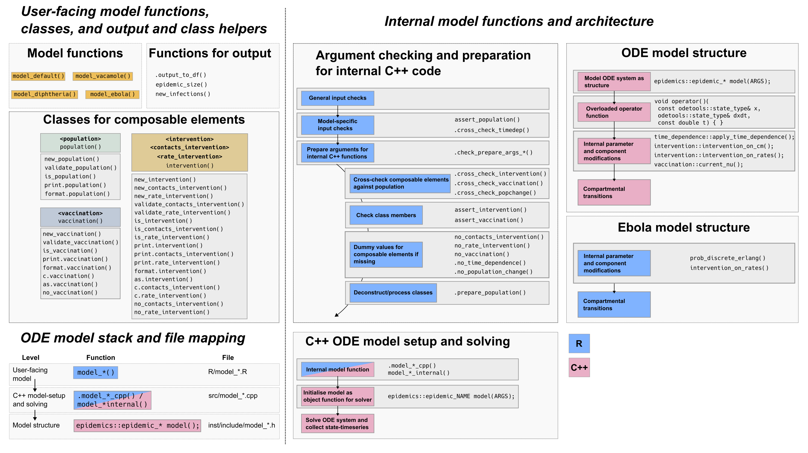

```{r, include = FALSE}
knitr::opts_chunk$set(
  collapse = TRUE,
  comment = "#>"
)
```

This vignette outlines the design decisions that have been taken during the development of the _epidemics_ R package, and provides some of the reasoning, and possible pros and cons of each decision.

This document is primarily intended to be read by those interested in understanding the code within the package and for potential package contributors.

## Scope

_epidemics_ aims to help public health practitioners - rather than research-focussed modellers - to rapidly simulate disease outbreak scenarios, and aims to **balance flexibility, performance, user-friendliness, and maintainability**.

 - _epidemics_ trades away some flexibility in defining model structures for a gain in the ease of defining epidemic scenario components such as affected populations and model events.

 - _epidemics_ balances performance and maintainability by leveraging the [_odin_](https://cran.r-project.org/package=odin) package, a domain-specific language that defines ODE systems in R, compiles them to efficient C code, and integrates with deSolve for numerical integration, providing a user-friendly and maintainable framework for epidemic modeling.

 - To be more broadly applicable, _epidemics_ provides a 'library' of compartmental models which are adapted from the published literature. These models focus on broad types of diseases or settings, rather than specific diseases or scenarios. Thus all models are intended to be applicable to a range of diseases.

## Output

All function outputs are expected to return a structure that inherits from `<data.frame>`, to make further processing easier for users.
The exact structure of the output - whether a list of `<data.frame>`s, a `<data.table>` or `<tibble>`, or a nested version of these tabular data classes - is yet to be fixed.
The eventual stable output type must allow users to conveniently access the epidemic trajectory data, identify and filter intervention scenarios for comparisons among them, and allow interoperability with data science tools such as the [Tidyverse](https://www.tidyverse.org/).

<!-- ## Package architecture -->

<!--  -->

<!-- **Fig. 1:** _epidemics_ is designed to allow easy combination of composable elements with a model structure taken from a library of published models, with sensible default parameters, to allow public health practitioners to conveniently model epidemic scenarios and the efficacy of response strategies. -->

<!--  -->

<!-- **Fig. 2:** _epidemics_ package architecture and ODE model stack. The epidemics package includes multiple internal R functions to check that inputs are suitable for each model and to cross-check compatibility between composable elements, such as `<population>`, `<intervention>`, and <vaccination>. These inputs are passed to odin-based ODE models defined in `inst/odin/`. Function names indicate their behavior (e.g., `assert_*())`, but not all similarly named functions are called at similar points in model function bodies. This reflects the privileged position of some components (e.g., `<population>`, against which other components are checked) and the fact that some composable elements (e.g., time-dependence) may not be vectorized. -->
 
## Design decisions

### Epidemic modelling

The notes here refer to broad decisions and not to individual models -- see individual model vignettes and published sources for modelling decisions.

- There are two broad types of models:

  - Deterministic models implemented as solutions to systems of ordinary different equations (ODEs),
 
  - Stochastic models with discrete timesteps where individuals move between compartments probabilistically.

- _epidemics_ models' compartmental transitions are fixed. Users cannot create new links between compartments, although links between compartments can be disallowed by modifying model parameters.

- The models' epidemiological parameter sets are unique, although some parameters are shared among models. These can be changed by users although reasonable default values are provided.

- The model components - such as the population affected by the epidemic, or any policy responses in the form of interventions - are called **composable elements**. Composable elements can be and are expected to be modified by users to match their situation. All model components except the `population` are optional.

- Each model allows a unique sets of composable elements considered suitable for the expected use case. E.g. the Ebola model does not allow modelling a vaccination regime, as this is considered unlikely for most Ebola outbreaks. The allowed set of composable elements is subject to change, and is open to user requests.

- The **effect of interventions is modelled as being additive, not multiplicative**. When an intervention with an X% reduction in contacts overlaps with an intervention with a Y% reduction, the cumulative effect on contacts $C$ is $C \times 1 - (X + Y)$, rather than $C \times (1 - X)(1 - Y)$. Additive effects were considered easier for users to understand than multiplicative effects.

### ODE systems and models


- A common method for defining and solving ODEs in R is to write the ODE system in R and pass it to solvers such as `deSolve::lsoda()` from the [_deSolve_ package](https://cran.r-project.org/package=deSolve). We have opted against this approach (referred to as 'R-deSolve').

- Instead, the **epidemics** package uses the [_odin_package](https://cran.r-project.org/package=odin) to define and solve ODE systems for compartmental models. **odin** provides a domain-specific language within R to specify ODEs in a concise, readable, and modular way. In other words, odin allows ODEs to be written in a high-level, R-like syntax. It compiles these models to C code internally and uses **deSolve** for numerical integration, balancing performance with ease of use. This approach allows model parameters, initial conditions, and composable elements (e.g., interventions, vaccination regimes) to be defined in R, minimizing data conversion overhead and enabling seamless integration with other R-based tools in the [Epiverse-TRACE](https://epiverse-trace.github.io/) ecosystem..

- odin supports adaptive step-size solvers (via deSolve or its own solvers), ensuring numerical stability while maintaining performance. Unlike fixed-step solvers, adaptive methods adjust step sizes dynamically, improving accuracy for stiff systems.

odin simplifies ODE system definition by allowing:

  - Declarative syntax: ODEs are written in an intuitive, equation-oriented format.

  - Events/callbacks: Interventions (e.g., time-dependent parameter changes) can be cleanly integrated without manual handling inside the ODE.

  - Automatic compilation: The system is translated to optimised C, reducing manual low-level coding.

- In odin, equations describing **the right-hand side of model ODE systems $x' = f(x)$** are written as R expressions, which are compiled into efficient numerical code. Parameters and time-dependent effects (e.g., interventions) are seamlessly incorporated without requiring manual structs or function objects.

- odin handles initial conditions as standard R vectors or matrices, avoiding the need for external linear algebra libraries (e.g., Eigen). This simplifies interoperability with R while maintaining performance.

- The odin approach enables modularity—model components (e.g., vaccination effects, interventions) can be defined separately and combined flexibly. This aligns with Epiverse-TRACE's composable design philosophy.

- Unlike C++-based workflows, odin eliminates the need for:

  - Manual memory management.

  - Header/source file separation.

  - Namespace management (R functions and environments handle scoping).

- For epidemics, this means faster development, easier debugging, and better maintainability while retaining computational efficiency.

### Stochastic models

_epidemics_ currently includes a single discrete-time stochastic model that implements a sub-compartment system taken from @getz2018, and initially adapted in _Epirecipes_.
Some modelling decisions are explained here, while recognising that adding more models with different implementations could see them being revisited.

  - Stochastic models currently target, and are expected to target, diseases for which outbreak sizes are initially small and thus where stochasticity matters more; the typical example is Ebola virus disease (simply, Ebola), and this is reflected in the model name.

  - The Ebola model is also expected to be suitable for diseases with a high fatality risk that are detected when outbreak sizes are small, and with an isolation and treatment response comparable to Ebola, e.g. Marburg virus disease.
 
  - **Note that** very different alternative implementations of stochastic models exist.

  - The current implementation was chosen due to the use of Erlang sub-compartments that were felt to better represent the long-tailed distributions of infection times seen in haemorrhagic fevers like Ebola.

  - The model implements a two-level structure similar to the ODE models, with `.model_ebola_internal()` the function implementing the simulation, while `model_ebola()` is the user-facing wrapper with input checks and parameter and scenario combination handling.
   
  - The model allows vectors for the infection parameters and the duration (called `time_end`); however the number of replicates for each parameter-scenario combination is not allowed to vary. A default of 100 was chosen as a reasonable middle ground between efficiency and realism.

  - The model allows lists of intervention sets and time-dependence functions to be passed.

    - Only interventions on model parameters are allowed, and interventions on social contacts are not allowed, as the model does not include age-stratification in transmission (or otherwise).

    - The parameters `infectiousness_rate` (often denoted $\sigma$) and `removal_rate` (recovery or death with safe burial, $\gamma$) _cannot_ be targeted by rate interventions or time-dependence as these values determine the number of sub-compartments in the exposed and infectious (and hospitalised) compartments, respectively. These are fixed at the start of the simulation, and changing them partway is challenging to support as it would involve redistributing individuals currently in any sub-compartment into more or fewer sub-compartments.

  - The model supports and defaults to multiple replicates or runs for each parameter-scenario combination.

    - For any $N$ runs with a single parameter set and a single intervention set, runs will differ due to stochasticity (essentially, as different random numbers are drawn for each run).

    - For any $N$ runs with multiple parameter sets and a single intervention set, runs will differ due to stochasticity _within_ parameter sets, but any differences between runs _across_ parameter sets (e.g. two different transmission rates) will be due to differences in parameter values alone.

    - For multiple runs of multiple parameter-scenario combinations, differences among runs will be due to differences in parameters and composable elements (such as interventions) alone.

    - The [_withr_ package](https://CRAN.R-project.org/package=withr) is used to ensure that seeds are preserved across parameter sets and interventions.

  - The input and output types correspond to the ODE model types.
  
  - The model is written in R [although this may change in future](https://github.com/epiverse-trace/epidemics/issues/179). The main reason for keeping the implementation in R is that the `stats::rmultinom()` function is a very efficient way of drawing from a categorical distribution (often called a discrete distribution) with heterogeneous probabilities. This [StackOverflow question from 2014](https://stackoverflow.com/questions/23097269/efficient-multinomial-sampling-when-sample-size-and-probability-vary) has more details including benchmarks against other implementations using _Rcpp_; though old, we have benchmarked a minimal example using _Boost_ and found that this information is still valid.

    - One possible reason to switch at least part of the Ebola model implementation to C++ is to make use of more efficient random number generation from the GNU Scientific Library via [_RcppGSL_](https://CRAN.R-project.org/package=RcppGSL), although there may be [issues for users trying to compile from source on Windows](https://stackoverflow.com/questions/55976547/linking-gsl-libraries-to-rcppgsl-in-windows-10).

### Classes

- The major composable elements are bundled into custom S3 classes that inherit from lists, and which are expected to be understandable elements of epidemic response: `<population>`, the `<intervention>` superclass, and `<vaccination>`. All other composable elements take the form of named, structured lists. These are not defined as classes because they are expected to be less used, or used by more advanced modellers who are comfortable working with lists directly.

- A key feature of composable elements being or inheriting from R lists is that they can be seamlessly passed as user-defined parameters to odin models, ensuring flexibility and ease of integration in specifying epidemiological scenarios.

- All matrix objects referring to demography-group coefficients follow the 'demography-in-rows' pattern from _finalsize_, where rows represent demography groups, and columns represent coefficients. This includes the initial conditions matrix in `<population>`s, where columns are epidemiological compartments, but also vaccination rates in `<vaccination>`, and contacts reductions in `<contacts_intervention>`s.

- Interventions may be of the `<contacts_intervention>` or `<rate_intervention>` class, which inherit from the abstract super-class `<intervention>`. This inheritance structure was chosen to maintain coherence between the intervention types, and to keep the option open of unifying these classes into a single concrete type in the future.

- All composable elements except `<population>` are optional. Model functions internally generate default (dummy) values for optional composable elements allowed for each model, ensuring that odin models can run without requiring user-specified inputs for every element.

- `<intervention>` and `<vaccination>` objects may be combined with objects of the same (sub)-class using the `c()` method for each (sub)-class, and resulting in an object of the same (sub)-class. The interpretation for each class is however slightly different:

  - `<intervention>`: Combining two interventions of the same sub-class is understood to represent the combined application of multiple epidemic response strategies, e.g. closing schools and also closing workplaces, or introducing mask mandates over different intervals.

  - `<vaccination>`: Combining two vaccination objects results in a two-dose vaccination regime, rather than two separate vaccination campaigns (each delivering a single dose). This is because _epidemics_ focuses on the initial pandemic response phase where vaccination is not expected to be available at scale, rather than long-term vaccination campaigns against endemic infections.

### Function vectorisation

_epidemics_ is moving towards allowing vectors or lists to be passed as model function arguments, to easily allow the incorporation of parameter uncertainty and comparisons of multiple scenarios (while maintaining comparability across scenarios in each function call). Consequently, each function call may consist of many 1000s of model runs ([see PR #176](https://github.com/epiverse-trace/epidemics/pull/176) and the [vignette on scenario modelling](modelling_scenarios.html)).

- All model epidemiological parameters are allowed to be passed as numeric vectors (currently only ODE models). This includes `time_end`, which allows runs of different durations within a single function call. This [use case was taken from this report](https://gaza-projections.org/) which aimed to calculate the epidemic size over a given period with uncertainty in the start time (and hence the duration). _epidemics_ [follows the Tidyverse rules on vector recycling](https://vctrs.r-lib.org/reference/theory-faq-recycling.html) for epidemiological parameters.

- Arguments `intervention` and `vaccination` accepting composable elements are allowed to be passed as lists of inputs. In the case of `intervention`, this is a list of lists, with each element a list of `<intervention>` objects (typically one `<contacts_intervention>` and a variable number of `<rate_intervention>`s): this is **referred to as an intervention set**. All other composable elements may currently only be scalar values, but this may change in future ([see issue #181 for passing lists of populations](https://github.com/epiverse-trace/epidemics/issues/181)).

- Model functions internally create combinations of composable elements, and each such combination is referred to as a **scenario**, and also combine each scenario with each set of epidemiological parameters. This is to ensure comparability across scenarios.

## Miscellaneous decisions

- - _epidemics_ follows the example of the _finalsize_ package in adhering to the tidyverse style guide for R code, ensuring consistency and readability across the Epiverse-TRACE ecosystem. For odin model definitions, stored in `inst/odin/`, the package adopts **odin**’s conventions for clear and concise ODE system specifications, enhancing maintainability and user-friendliness.

- Function naming: Function names aim to contain verbs that indicate the function behaviour. Internal input checking functions follow the _checkmate_ naming style (e.g. `assert_*()`).

- Internal functions are prefixed with a . (e.g., `.model_default_odin())` to clearly indicate that they are not intended for direct use by end-users, distinguishing them from user-facing functions like `run_seir_model()`. 

---

## Dependencies

The aim is to restrict the number of hard dependencies while maintaining user-friendliness.

- [_odin_](https://CRAN.R-project.org/package=odin): for defining and solving ODE equations.
- [_checkmate_](https://CRAN.R-project.org/package=checkmate): a useful input-checking package used across Epiverse packages;
- [_cli_](https://CRAN.R-project.org/package=cli) and [_glue_](https://CRAN.R-project.org/package=glue): convenience packages for pretty printing methods; these could be reconsidered to lighten package dependencies;
- [_data.table_](https://CRAN.R-project.org/package=data.table): a lightweight dependency to handle data from model outputs, and especially used for nested list column functionality.
- [_withr_](https://CRAN.R-project.org/package=withr): for seed management;
- _stats_ and _utils_: already installed with R, and used only in the Ebola model, and hence liable to be removed in the future.

A wider range of packages are taken on as soft dependencies to make the vignettes more user-friendly.

- [_bench_](https://CRAN.R-project.org/package=bench): to benchmark _epidemics_ against _finalsize_;
- [_bookdown_](https://CRAN.R-project.org/package=bookdown), [_knitr_](https://CRAN.R-project.org/package=knitr), [_rmarkdown_](https://CRAN.R-project.org/package=rmarkdown): packages to generate vignettes and format them;
- [_dplyr_](https://CRAN.R-project.org/package=dplyr), [_tibble_](https://CRAN.R-project.org/package=tibble), [_tidyr_](https://CRAN.R-project.org/package=tidyr): to show the processing of model outputs;
- [_EpiEstim_](https://CRAN.R-project.org/package=EpiEstim): to show links with upstream packages that estimate R in a vignette;
- [_finalsize_](https://CRAN.R-project.org/package=finalsize): for comparison against _epidemics_ in a vignette;
- [_ggplot2_](https://CRAN.R-project.org/package=ggplot2), [_scales_](https://CRAN.R-project.org/package=scales), [_colorspace_](https://CRAN.R-project.org/package=colorspace): packages for plotting;
- [_socialmixr_](https://CRAN.R-project.org/package=socialmixr): to obtain social contacts matrices;
- [_spelling_](https://CRAN.R-project.org/package=spelling): for spell-checking;
- [_testthat_](https://CRAN.R-project.org/package=testthat) (>= 3.0.0): for unit tests.

## Contribute

There are no special requirements to contributing to _epidemics_, but contributions of new models should be clearly motivated, fall within the scope of the package, target a disease type or situation that is not already covered by existing models, and ideally should already be peer-reviewed.
In general, please follow the [package contributing guide](https://github.com/epiverse-trace/.github/blob/main/CONTRIBUTING.md).
